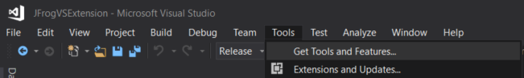
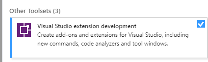
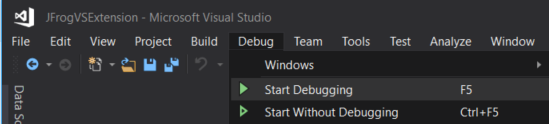

# JFrog Visual Studio Extension

|         Target          |                                                                           Status                                                                            |
|:-----------------------:|:-----------------------------------------------------------------------------------------------------------------------------------------------------------:|
|   Visual Studio 2022    |   |
| Visual Studio 2017,2019 |  |

# Table of Contents

- [About this Extension](#about-this-extension)
  - [Component Tree Icons](#component-tree-icons)
- [Installing the Extension](#installing-the-extension)
- [Building the Sources](#building-the-sources)
- [Troublshooting Issues](#troublshooting-issues)
- [Release Notes](#release-notes)
- [Code Contributions](#code-contributions)

## About this Extension
JFrog Visual studio extension adds JFrog Xray scanning of NuGet project dependencies to your Visual Studio.
To learn how to use the extension, please visit the [JFrog Visual Studio Extension User Guide](https://www.jfrog.com/confluence/display/XRAY/IDE+Integration#IDEIntegration-JFrogVisualStudioExtension).

### Component Tree Icons
The icon demonstrates the top severity issue of a selected component and its transitive dependencies. The following table describes the severities from lowest to highest:
|                 Icon                | Severity |                                       Description                                      |
|:-----------------------------------:|:--------:|:---------------------------------------------------------------------------------------|
|      |  Normal  | Scanned - No Issues                                                                    |
|    |  Unknown | No CVEs attached to the vulnerability or the selected component not identified in Xray |
|            |    Low   | Top issue with low severity                                                            |
|      |  Medium  | Top issue with medium severity                                                         |
|          |   High   | Top issue with high severity                                                           |
|  | Critical | Top issue with critical severity  

## Installing the Extension
1. Make sure nuget.exe exists under your PATH environment variable
2. Open Visual Studio
3. Open *Tools* --> *Extensions and Updates*

4. Search for JFrog Visual Studio Extension
5. Click on *Download*
6. Once the installation is completed, re-open Visual Studio.

## Building the Sources

To build the plugin sources, please follow these steps:
1. Clone the code from git.
2. Download the [JFrog CLI executable](https://jfrog.com/getcli/) for Windows and place it under **$PROJECT_LOCATION\JFrogVSExtension\Resources**.
3. Open Visual Studio.
4. Open *Tools* --> *Get Tools and Features*

5. Select the *workloads* tab and scroll to the bottom for the *Other Toolsets* section. Install *Visual Studio extension development*. Read more about Visual Studio SDK [here](https://docs.microsoft.com/en-us/visualstudio/extensibility/installing-the-visual-studio-sdk?view=vs-2017).

6. Once the installation is completed, re-open Visual Studio.
7. Click on *File* --> *Open* --> *Project/Solution* and navigate to the project root dir and select the sln file.
8. To build the project, click on *Build* tab --> *Build Solution*. The VSIX file will be created in the following location: **$PROJECT_LOCATION\bin\Release\JFrog.VSExtension.vsix**
9. If the build fails, please refer to the *Troublshooting Issues* section.

10. If you'd like to help us develop and enhance the extension, this step is for you.
   To build and run the plugin following your code changes, click on *Debug* --> *Start Debugging*.
                           

## Troublshooting Issues
When openning the project in Visual Studio for the first time, the following error may appear : *"Fody.WeavingTask" task was not given a value for the required parameter "SolutionDir"*.

To fix this,close the solution and open it again. More information can be found [here](https://stackoverflow.com/questions/50225374/xamarinissues-with-fody-weavingtask-and-solutiondir)

## Release Notes
The release notes are available [here](RELEASE.md#release-notes).

## Code Contributions
We welcome community contribution through pull requests.
